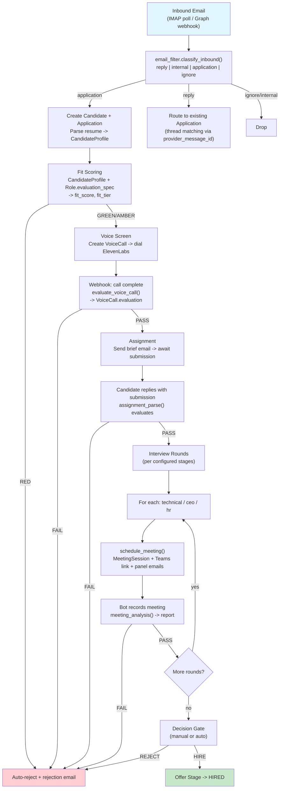

# HR Agent - Backend Architecture

> Living reference for developers. Covers database schema, pipeline engine, data flows, and integration points.

---

## Table of Contents

1. [System Overview](#system-overview)
2. [Entity-Relationship Diagram](#entity-relationship-diagram)
3. [Database Schema](#database-schema)
4. [Pipeline Engine](#pipeline-engine)
5. [Candidate Lifecycle](#candidate-lifecycle)
6. [LLM Integration](#llm-integration)
7. [Key Services](#key-services)
8. [API Layer](#api-layer)

---

## System Overview

The HR Agent is a multi-tenant recruitment automation platform. A configurable per-role pipeline drives candidates from intake through screening, assessment, interviews, and offer. The system blends autonomous AI stages (resume parsing, fit scoring, voice screening) with manual human gates (admin review, decision).

**Core design principles:**

- **Pipeline-as-data** -- each `Role` owns an ordered list of `RolePipelineStages`; the engine is a pure planner over that list.
- **Event-sourced inbox** -- `domain_events` with `requires_action` flags replace the retired supervisor; `action_overlay` tracks human state (snooze/assign/dismiss).
- **CAS guards** -- `processing_status` columns use compare-and-swap to prevent duplicate processing of voice calls and other async results.
- **Single-org today** -- `organizations` is a single-row tenant anchor; all FK chains root here for future multi-tenancy.

---

## Entity-Relationship Diagram

```mermaid
erDiagram
    organizations ||--o{ users : "has members"
    organizations ||--o{ candidates : "sources"
    organizations ||--o{ roles : "defines"
    organizations ||--o{ config_settings : "configures"
    organizations ||--o{ domain_events : "emits"
    organizations ||--o{ action_overlay : "tracks"
    organizations ||--o{ notifications : "sends"
    organizations ||--o{ recruiter_conversations : "hosts"
    organizations ||--o{ recruiter_memory : "stores"
    organizations ||--o{ panel_members : "registers"

    roles ||--o{ role_pipeline_stages : "has stages"
    roles ||--o{ applications : "receives"
    roles ||--o{ assignments : "defines"

    candidates ||--o{ applications : "submits"
    candidates ||--o{ candidate_profiles : "has profiles"
    candidates ||--o{ consent_artifacts : "records consent"

    applications ||--o{ voice_calls : "triggers"
    applications ||--o{ meeting_sessions : "schedules"
    applications ||--o{ screening_responses : "collects"
    applications ||--o{ assessment_results : "produces"
    applications ||--o{ email_sends : "sends"
    applications ||--o{ audit_log : "logged in"
    applications ||--o{ domain_events : "emits"

    users ||--o{ notifications : "receives"

    recruiter_conversations ||--o{ recruiter_messages : "contains"
    recruiter_conversations ||--o{ recruiter_artifacts : "produces"

    organizations {
        UUID id PK
        string name
        string slug UK
        JSONB hiring_persona
        JSONB settings
        timestamp created_at
        timestamp updated_at
    }

    users {
        UUID id PK
        UUID org_id FK
        string email UK
        string name
        string google_sub
        string avatar_url
        string role "default: member"
        string seat_status "default: active"
        timestamp created_at
        timestamp last_seen_at
    }

    candidates {
        UUID id PK
        UUID org_id FK
        string email UK
        string phone
        string name
        string linkedin_url
        string status "default: intake"
        string source_channel
        string temporal_workflow_id
        string timezone
        timestamp consent_captured_at
        text consent_text_shown
        timestamp created_at
        timestamp updated_at
    }

    roles {
        UUID id PK
        UUID org_id FK
        string title
        text jd_text
        JSONB screening_questions
        JSONB scoring_rubric
        int cut_line "default: 60"
        JSONB interviewer_panel
        string status "open|paused|filled|cancelled"
        decimal ctc_min_lpa
        decimal ctc_max_lpa
        int max_notice_days
        string location
        string remote_policy
        text assignment_brief
        text assignment_instructions
        int assignment_deadline_days "default: 7"
        string assignment_problem_doc_key
        string assignment_problem_filename
        string screening_modality "default: voice"
        JSONB evaluation_spec "EvaluationSpec"
        JSONB company_context "RoleContext"
        timestamp created_at
    }

    applications {
        UUID id PK
        UUID candidate_id FK
        UUID role_id FK
        UUID org_id FK
        string status "active|rejected|withdrawn"
        float fit_score
        string fit_tier "green|amber|red"
        float screening_score
        JSONB screening_questions
        JSONB screening_evaluation
        JSONB assignment_submission
        JSONB admin_review
        text journey_report
        string current_stage "legacy enum"
        string current_stage_key "FK stage_key"
        string stage_status "StageStatus enum"
        JSONB stage_results "per-stage overlay"
        timestamp created_at
        timestamp updated_at
    }

    role_pipeline_stages {
        UUID id PK
        UUID role_id FK
        UUID org_id FK
        int position
        string stage_type
        string stage_key UK "per role"
        string label
        string mode "auto|manual"
        bool is_enabled
        JSONB config "PipelineStageConfig"
        JSONB eval_spec "StageEvalSpec"
        timestamp created_at
        timestamp updated_at
    }

    voice_calls {
        UUID id PK
        UUID application_id FK
        string candidate_phone
        JSONB questions
        JSONB answers
        JSONB evaluation
        string status
        string verdict
        float overall_score
        string processing_status "CAS guard"
        string provider
        string provider_call_id
        timestamp scheduled_at
        timestamp started_at
        timestamp ended_at
        int duration_sec
        int attempt_no
        string recording_r2_key
        string transcript_r2_key
        JSONB emotion_features
        timestamp created_at
        timestamp updated_at
    }

    email_sends {
        UUID id PK
        UUID application_id
        UUID candidate_id
        string to_email
        string template
        string subject
        string provider
        string provider_message_id
        string status
        string error
        timestamp created_at
    }

    meeting_sessions {
        UUID id PK
        UUID application_id FK
        string round "technical|ceo|hr"
        string teams_join_url
        timestamp scheduled_at
        string bot_provider
        string bot_id
        string bot_status
        JSONB report
        text llm_report
        float overall_score
        float technical_score
        float communication_score
        float confidence_score
        string verdict
        timestamp created_at
        timestamp updated_at
    }

    processed_messages {
        UUID id PK
        string provider
        string message_id UK
        UUID application_id
        string action
        timestamp created_at
    }

    candidate_profiles {
        UUID id PK
        UUID candidate_id FK
        string raw_resume_r2_key
        JSONB parsed_data
        JSONB extraction_confidence
        vector embedding "1536 dims"
        timestamp created_at
    }

    screening_responses {
        UUID id PK
        UUID application_id FK
        JSONB responses
        bool knock_out_triggered
        string knock_out_reason
        float composite_score
        timestamp submitted_at
    }

    assessment_results {
        UUID id PK
        UUID application_id FK
        string assessment_kind
        string provider
        string fit_band
        float normalized_score
        float percentile
        JSONB normalized
        timestamp created_at
    }

    assignments {
        UUID id PK
        UUID role_id FK
        string title
        text brief_markdown
        text instructions
        JSONB problems
        int deadline_days
        timestamp created_at
        timestamp updated_at
    }

    domain_events {
        bigint id PK
        UUID org_id
        UUID application_id
        UUID role_id
        string type
        JSONB payload
        string actor
        bool requires_action
        timestamp resolved_at
        string resolved_by
        timestamp created_at
    }

    audit_log {
        serial id PK
        UUID candidate_id
        UUID application_id
        string action
        string actor
        JSONB details
        string model_version
        string prompt_version
        string langfuse_trace_id
        timestamp created_at
    }

    action_overlay {
        UUID id PK
        UUID org_id
        string action_key UK
        timestamp snoozed_until
        UUID assigned_to FK
        timestamp dismissed_at
        timestamp last_seen_at
        timestamp created_at
        timestamp updated_at
    }

    notifications {
        UUID id PK
        UUID org_id
        UUID user_id FK
        string type
        string title
        string body
        string link
        timestamp read_at
        timestamp created_at
    }

    recruiter_conversations {
        UUID id PK
        UUID org_id
        string user_hash
        string title
        text system_prompt
        string model
        timestamp started_at
        timestamp last_message_at
    }

    recruiter_messages {
        UUID id PK
        UUID conversation_id FK
        string role "user|assistant|system|tool"
        text content
        JSONB tool_calls
        string tool_call_id
        string name
        timestamp created_at
    }

    recruiter_memory {
        UUID id PK
        UUID org_id
        string scope
        string key "UK per org+scope"
        JSONB value
        timestamp created_at
        timestamp updated_at
    }

    recruiter_artifacts {
        UUID id PK
        UUID conversation_id FK
        UUID org_id
        UUID application_id
        string type "role_draft etc"
        string status "draft|ready|applied"
        string title
        JSONB content
        int version
        timestamp created_at
        timestamp updated_at
    }

    config_settings {
        UUID id PK
        UUID org_id
        string key "UK per org"
        JSONB value
        string updated_by
        timestamp created_at
        timestamp updated_at
    }

    panel_members {
        UUID id PK
        UUID org_id
        string email
        string name
        string role_type "technical|ceo|hr"
        JSONB expertise
        bool is_active
        timestamp created_at
        timestamp updated_at
    }
```



---

## Database Schema

### Core Entities

| Table | Purpose | Key columns |
|---|---|---|
| `organizations` | Tenant anchor (single row today) | `slug` (unique), `hiring_persona` (JSONB), `settings` (JSONB, includes `email_domains`) |
| `users` | Identity + workspace seat | `email` (unique), `role` (member), `seat_status` (active) |
| `candidates` | One row per person across all roles | `email` (unique), `status` (intake), `temporal_workflow_id`, `timezone` |
| `roles` | Job descriptions + config | `evaluation_spec` (JSONB -- EvaluationSpec), `company_context` (JSONB -- RoleContext), `screening_modality` (voice), `cut_line` (60) |
| `applications` | Candidate + Role junction | `current_stage_key` (references `role_pipeline_stages.stage_key`), `stage_status` (StageStatus enum), `stage_results` (JSONB -- `{stage_key: {processing_status, verdict, result_ref, updated_at}}`) |

### Pipeline System

| Table | Purpose | Key columns |
|---|---|---|
| `role_pipeline_stages` | Per-role ordered pipeline (source of truth) | `stage_type` (intake\|parse\|email_filter\|fit\|screening\|voice_screen\|assignment\|assessment_review\|interview\|decision\|offer), `stage_key` (unique per role), `position` (ordering), `mode` (auto\|manual), `config` (JSONB -- PipelineStageConfig), `eval_spec` (JSONB -- StageEvalSpec) |

> **Constraint:** `UNIQUE(role_id, stage_key)`, `INDEX(role_id, position)`

### Communication

| Table | Purpose | Key columns |
|---|---|---|
| `voice_calls` | Voice screening call records | `processing_status` (CAS guard: null\|processing\|processed\|failed), `provider_call_id`, `recording_r2_key`, `transcript_r2_key`, `emotion_features` (JSONB) |
| `email_sends` | Outbound email log | `provider_message_id` (for thread matching), `template` |
| `meeting_sessions` | Interview meetings (Teams) | `round` (technical\|ceo\|hr), `teams_join_url`, `bot_id`, `bot_status`, `report` (JSONB), `llm_report` (Text) |
| `processed_messages` | Inbound email dedup | `message_id` (unique) |

### Assessment

| Table | Purpose | Key columns |
|---|---|---|
| `candidate_profiles` | Parsed resumes | `raw_resume_r2_key`, `parsed_data` (JSONB), `embedding` (Vector 1536) |
| `screening_responses` | Written screening answers | `knock_out_triggered`, `composite_score` |
| `assessment_results` | PI / cognitive test results | `assessment_kind`, `fit_band`, `normalized_score`, `percentile` |
| `assignments` | Take-home assignment metadata | `problems` (JSONB), `deadline_days` |

### Events & Audit

| Table | Purpose | Key columns |
|---|---|---|
| `domain_events` | Durable event log (replaces retired supervisor) | `type` (stage_changed\|requires_action\|candidate_email_reply\|...), `requires_action` (bool), `resolved_at`. Index: `(org_id, requires_action, resolved_at)` for inbox query |
| `audit_log` | Immutable audit trail | `action`, `actor`, `model_version`, `prompt_version`, `langfuse_trace_id` |
| `action_overlay` | Human state on inbox items | `action_key` (unique), `snoozed_until`, `assigned_to` (FK users), `dismissed_at` |
| `notifications` | Bell notifications for users | `user_id` (FK), `type`, `read_at` |

### Recruiter Chat

| Table | Purpose | Key columns |
|---|---|---|
| `recruiter_conversations` | Chat sessions | `user_hash`, `model`, `system_prompt` |
| `recruiter_messages` | Chat messages | `role` (user\|assistant\|system\|tool), `tool_calls` (JSONB), `tool_call_id` |
| `recruiter_memory` | Agent memory (key-value per scope) | `scope`, `key` (unique per org+scope), `value` (JSONB) |
| `recruiter_artifacts` | Structured outputs (role_draft, etc.) | `type`, `status` (draft\|ready\|applied), `content` (JSONB), `version` |

### Config & Other

| Table | Purpose | Notes |
|---|---|---|
| `config_settings` | App config (key-value per org) | |
| `config_audit` | Config change log | |
| `consent_artifacts` | GDPR consent records | |
| `panel_members` | Workspace-level interview panel directory | `role_type` (technical\|ceo\|hr), `expertise` (JSONB) |
| `voice_campaigns` | Batch voice calling campaigns | |
| `webhook_events` | Webhook delivery log | |
| `pipeline_alerts` | Alert rules | |
| `interviews` | **Legacy** -- replaced by `meeting_sessions` | |
| `supervisor_events` / `supervisor_actions` | **Retired** -- supervisor is dead | |
| `evidence_records` / `decision_records` / `policy_rules` | Evidence framework tables | |

---

## Pipeline Engine

The pipeline is the central orchestration mechanism. It is split into three layers:

```
┌─────────────────────────────────────────────────────┐
│  stage_runner.py    (verdict interface)              │
│  Evaluators call advance_candidate(PASS/FAIL/ON_GOING)│
├─────────────────────────────────────────────────────┤
│  pipeline_engine.py (pure planner)                  │
│  Reads stages + current position -> returns action  │
├─────────────────────────────────────────────────────┤
│  auto_progress.py   (IO shell)                      │
│  Executes plan: fires activities or parks           │
└─────────────────────────────────────────────────────┘
```

### Stage Types

| `stage_type` | Behavior | Mode |
|---|---|---|
| `intake` | Candidate + Application creation | inline (during intake) |
| `parse` | Resume parse into CandidateProfile | inline |
| `email_filter` | Classify inbound email | inline |
| `fit` | LLM fit scoring against EvaluationSpec | inline |
| `screening` | Written screening questions | auto |
| `voice_screen` | Voice call via ElevenLabs | auto |
| `assignment` | Take-home assignment dispatch + eval | auto |
| `assessment_review` | Admin review gate | manual |
| `interview` | Teams meeting (technical/ceo/hr) | auto/manual |
| `decision` | Hire/reject decision | manual |
| `offer` | Offer stage | manual |

### Flow

1. **Inline stages** (`email_filter`, `fit`) execute synchronously during intake. The engine marks them complete and skips past.
2. **Auto stages** fire immediately when the candidate arrives. The engine returns an action (e.g., `FIRE_VOICE_SCREEN`, `DISPATCH_ASSIGNMENT`), and `auto_progress.py` executes it.
3. **Manual gates** park the candidate and emit a `domain_event` with `requires_action=true`. The dashboard inbox surfaces these for human action.
4. **Verdict recording:** When an async evaluator finishes (voice call webhook, meeting analysis), it calls `stage_runner.advance_candidate(verdict=PASS|FAIL|ON_GOING)`. The runner writes the verdict into `application.stage_results[stage_key]` and delegates back to the engine for the next step.

### `application.stage_results` Structure

```json
{
  "voice_screen": {
    "processing_status": "processed",
    "verdict": "PASS",
    "result_ref": "voice_calls/<uuid>",
    "updated_at": "2026-06-22T08:00:00Z"
  },
  "technical": {
    "processing_status": "processed",
    "verdict": "PASS",
    "result_ref": "meeting_sessions/<uuid>",
    "updated_at": "2026-06-22T09:00:00Z"
  }
}
```

---

## Candidate Lifecycle



### Stage-by-Stage Detail

#### 1. Intake (inline)

- **Trigger:** Inbound email detected by IMAP poller or Microsoft Graph push notification.
- **Logic:** `email_filter.classify_inbound()` classifies the email as `reply`, `internal`, `application`, or `ignore`.
- **On application:** Upsert `candidates` row (dedup on email), create `applications` row, extract resume attachment, parse to `candidate_profiles` (R2 storage for raw file, JSONB for parsed data, 1536-dim embedding).
- **Dedup:** `processed_messages.message_id` prevents reprocessing.

#### 2. Fit Scoring (inline)

- **Input:** `candidate_profiles.parsed_data` + `roles.evaluation_spec` (via `scoring_context.py`).
- **Output:** `applications.fit_score`, `applications.fit_tier` (green/amber/red).
- **Threshold:** `roles.cut_line` (default 60). Below threshold = red = auto-reject with email.
- **Audit:** `audit_log` entry with `model_version`, `langfuse_trace_id`.

#### 3. Voice Screen (auto)

- **Dispatch:** `dispatch_voice_screening` creates `voice_calls` row (status=pending), calls ElevenLabs API.
- **CAS guard:** `processing_status` column (null -> processing -> processed/failed) prevents duplicate evaluation.
- **Webhook:** ElevenLabs posts to `/webhooks/voice/elevenlabs`. On completion: transcript + recording stored in R2, `evaluate_voice_call` runs LLM evaluation.
- **Result:** `voice_calls.evaluation` (JSONB), `voice_calls.verdict`, `voice_calls.overall_score`.

#### 4. Assignment (auto)

- **Dispatch:** `dispatch_assessment` sends email with `roles.assignment_brief` + `roles.assignment_instructions`. Problem doc fetched from R2 via `assignment_problem_doc_key`.
- **Collection:** Candidate replies by email. `email_filter` classifies as reply, routes to application. `assignment_parse` extracts and evaluates submission.
- **Result:** `applications.assignment_submission` (JSONB).

#### 5. Interviews (auto/manual per stage)

- **Scheduling:** `services/scheduling.py` finds available slots based on panel availability.
- **Meeting creation:** `services/online_meeting.py` creates Teams meeting via Microsoft Graph API.
- **Per round:** `meeting_sessions` row created with `round` = `stage_key` (e.g., "technical", "ceo", "hr"). Panel members notified by email.
- **Recording:** Bot joins meeting (`bot_provider`, `bot_id`). On completion, webhook at `/webhooks/meeting/readai` triggers analysis.
- **Analysis:** `meeting_analysis` produces `meeting_sessions.report` (structured JSONB) + `meeting_sessions.llm_report` (narrative text), scores (overall, technical, communication, confidence), and verdict.

#### 6. Decision + Offer (manual)

- Decision gate raises `domain_event` with `requires_action=true`.
- Recruiter reviews journey report (`applications.journey_report`) and acts via dashboard.
- On hire: advance to offer stage. On reject: rejection email.

---

## LLM Integration

```
┌──────────────────────────────────────────────────┐
│                  Calling Code                     │
│  (activities, services, evaluators)               │
├──────────────────────────────────────────────────┤
│  llm/prompt_manager.py                           │
│  Fetches prompts from Langfuse (stale-while-     │
│  revalidate cache), falls back to local templates │
├──────────────────────────────────────────────────┤
│  llm/model_registry.py                           │
│  Maps each stage/task to a specific model         │
├──────────────────────────────────────────────────┤
│  llm/client.py                                   │
│  LiteLLM wrapper + Langfuse tracing              │
│  All LLM calls route through here                │
└──────────────────────────────────────────────────┘
```

- **Tracing:** Every LLM call gets a `langfuse_trace_id` written to `audit_log` for observability and debugging.
- **Scoring context:** `services/scoring_context.py` extracts role-specific criteria from `roles.evaluation_spec` and `roles.company_context` to ground LLM evaluations.
- **Model selection:** `model_registry.py` allows different models per stage (e.g., cheaper model for classification, stronger model for evaluation).

---

## Key Services

| Service | File | Responsibility |
|---|---|---|
| Email Filter | `services/email_filter.py` | Classify inbound email: reply, internal, application, ignore |
| Pipeline Engine | `services/pipeline_engine.py` | Pure planner: given stages + position, return next action |
| Auto Progress | `services/auto_progress.py` | IO shell: execute engine plan (fire activity or park) |
| Stage Runner | `services/stage_runner.py` | Record verdict (`PASS`/`FAIL`/`ON_GOING`), delegate to engine |
| Scoring Context | `services/scoring_context.py` | Extract role-specific evaluation criteria for LLM grounding |
| Voice Provider | `services/voice_provider.py` | Voice call dispatch abstraction (ElevenLabs) |
| Scheduling | `services/scheduling.py` | Interview slot finder based on panel availability |
| Online Meeting | `services/online_meeting.py` | Teams meeting creation via Microsoft Graph API |

---

## API Layer

### Dashboard APIs

| Endpoint | Method | Purpose |
|---|---|---|
| `/dashboard/v1/candidates/{id}` | GET | Candidate detail (CandidateDetail schema) |
| `/dashboard/roles` | CRUD | Role management |

### Agentic (Recruiter Chat) APIs

| Endpoint | Method | Purpose |
|---|---|---|
| `/agentic/chat` | POST | Recruiter chat (streaming) |
| `/agentic/artifacts/{id}/apply` | POST | Apply a role_draft artifact to create/update a role |

### Webhook Endpoints

| Endpoint | Provider | Purpose |
|---|---|---|
| `/webhooks/voice/elevenlabs` | ElevenLabs | Voice call status + transcript delivery |
| `/webhooks/meeting/readai` | Read.ai | Meeting recording + transcript delivery |
| `/webhooks/email/graph` | Microsoft Graph | Email push notifications (new mail in inbox) |

---

## External Dependencies

| System | Usage | Integration |
|---|---|---|
| **PostgreSQL** (+ pgvector) | Primary database, vector search for candidate matching | SQLAlchemy async |
| **Cloudflare R2** | Object storage for resumes, recordings, transcripts | S3-compatible SDK |
| **ElevenLabs** | Conversational voice AI for screening calls | REST API + webhooks |
| **Microsoft Graph** | Email (IMAP/push), Teams meeting creation, calendar | OAuth2 + REST |
| **Read.ai** | Meeting bot for recording + transcription | Bot API + webhooks |
| **LiteLLM** | LLM gateway (OpenAI, Anthropic, etc.) | Python SDK |
| **Langfuse** | Prompt management + LLM tracing/observability | Python SDK |
| **Temporal** *(referenced)* | Workflow orchestration (candidate workflow IDs stored) | Python SDK |

---

## Appendix: Retired / Legacy

| Component | Status | Replacement |
|---|---|---|
| `supervisor_events` / `supervisor_actions` | **Retired** | `domain_events` + `action_overlay` |
| `interviews` table | **Legacy** | `meeting_sessions` |
| `applications.current_stage` (enum) | **Legacy** | `current_stage_key` (references `role_pipeline_stages.stage_key`) |
| `roles.pipeline_template` (JSONB) | **Deprecated** | `role_pipeline_stages` table |
