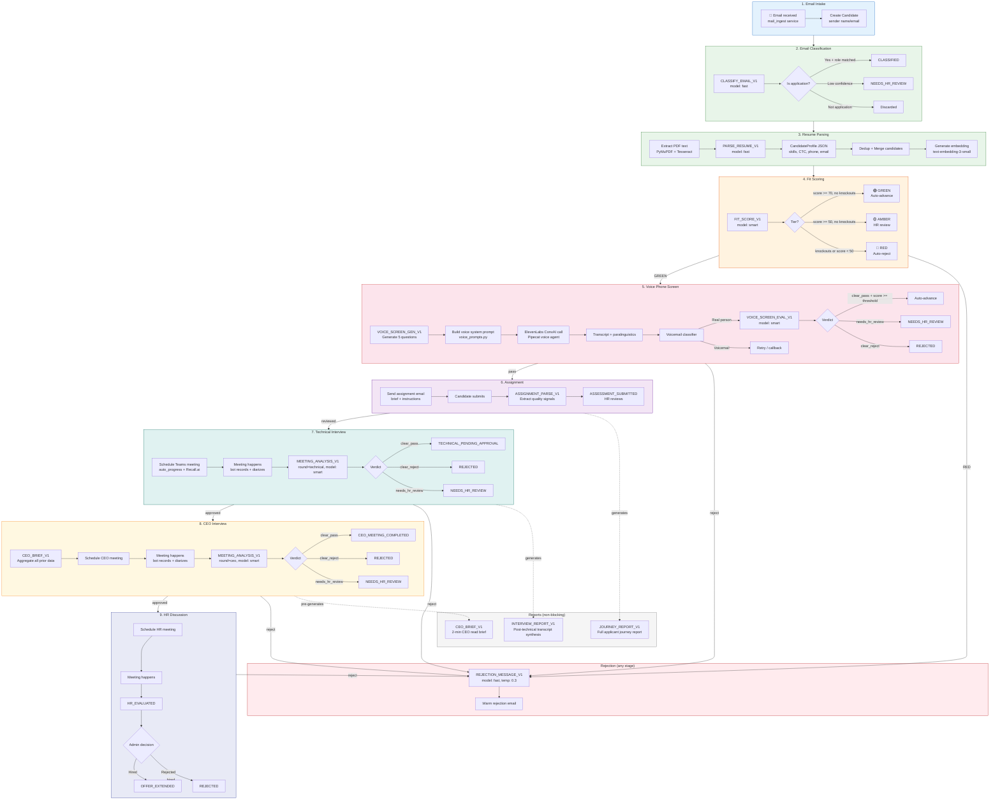
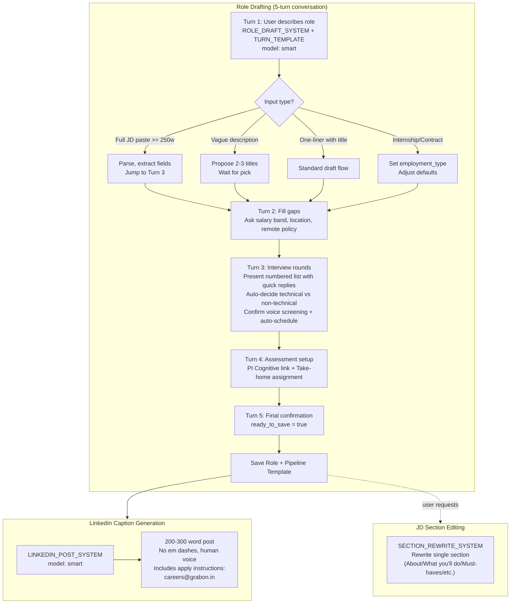
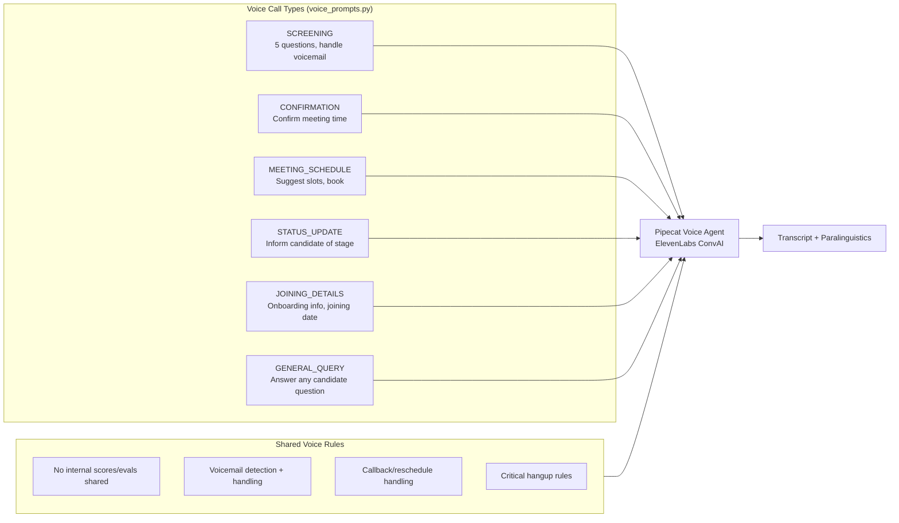
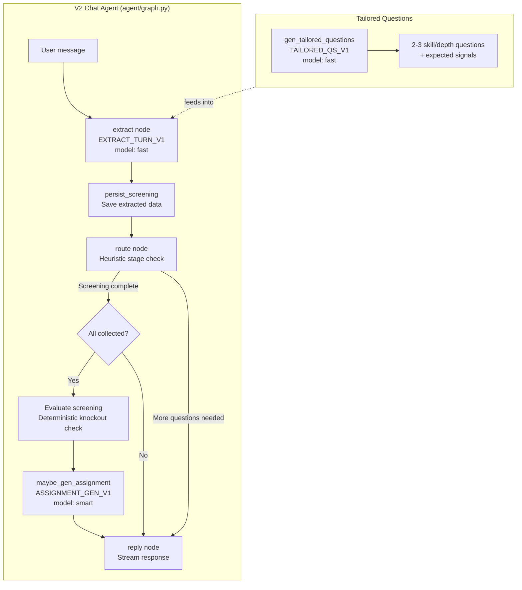
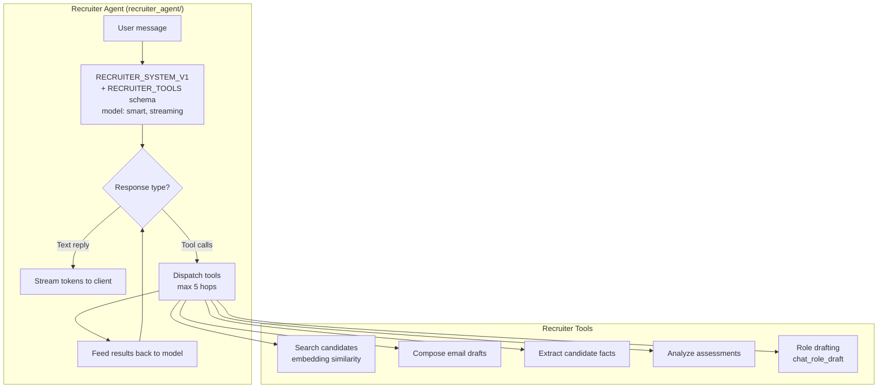

# HR Agent — Prompt & Pipeline Architecture

## Pipeline Flow (Stage-by-Stage)

## Role Creation Flow (Recruiter Chat)

## Voice Agent System (ElevenLabs ConvAI)

## Chat Agent (V2 LangGraph)

## Recruiter Agent (Pulse)

## Complete Prompt Registry

| # | Prompt | File | Model | Pipeline Stage | Purpose |
|---|--------|------|-------|----------------|---------|
| 1 | `CLASSIFY_EMAIL_V1` | `llm/prompts/classify_email.py` | fast | Intake → Classified | Classify incoming email as application |
| 2 | `PARSE_RESUME_V1` | `llm/prompts/parse_resume.py` | fast | Classified → Parsed | Extract structured profile from resume PDF |
| 3 | `FIT_SCORE_V1` | `llm/prompts/fit_score.py` | smart | Parsed → Scored | Score candidate vs JD (0-100 + tier) |
| 4 | `SCREENING_GEN_V1` | `llm/prompts/screening_gen.py` | auto | Pre-screening | Generate 5-7 tailored screening questions |
| 5 | `SCREENING_EVAL_V1` | `llm/prompts/screening_eval.py` | smart | Screening → Evaluated | Evaluate screening responses (verdict) |
| 6 | `SCORE_OPEN_TEXT_V1` | `llm/prompts/score_open_text.py` | smart | Per-question | Score individual open-text answer (0-10) |
| 7 | `VOICE_SCREEN_GEN_V1` | `llm/prompts/voice_screening.py` | auto | Pre-voice screen | Design 5 spoken phone-screen questions |
| 8 | `VOICE_SCREEN_EVAL_V1` | `llm/prompts/voice_screening.py` | smart | Post-voice call | Evaluate phone-screen transcript |
| 9 | `ASSIGNMENT_PARSE_V1` | `llm/prompts/assignment_parse.py` | auto | Assignment submitted | Parse assignment submission quality |
| 10 | `MEETING_ANALYSIS_V1` | `llm/prompts/meeting_analysis.py` | smart | Post-interview | Score diarized interview transcript |
| 11 | `INTERVIEW_REPORT_V1` | `llm/prompts/interview_report.py` | smart | Post-technical | Synthesize interview into report |
| 12 | `CEO_BRIEF_V1` | `llm/prompts/ceo_brief.py` | smart | Pre-CEO round | Aggregate all data into CEO brief |
| 13 | `JOURNEY_REPORT_V1` | `llm/prompts/journey_report.py` | smart | Any stage | Full applicant journey report |
| 14 | `REJECTION_MESSAGE_V1` | `llm/prompts/rejection_message.py` | fast | Any rejection | Draft warm rejection email |
| 15 | `ROLE_DRAFT_SYSTEM` | `llm/prompts/role_drafting.py` | smart | Role creation | 5-turn conversational JD builder |
| 16 | `LINKEDIN_POST_SYSTEM` | `llm/prompts/role_drafting.py` | smart | Post-role creation | Generate LinkedIn job post |
| 17 | `SECTION_REWRITE_SYSTEM` | `llm/prompts/role_drafting.py` | smart | JD editing | Rewrite single JD section |
| 18 | `EXTRACT_TURN_V1` | `agent/prompts.py` | fast | Chat screening | Extract data from candidate message |
| 19 | `TAILORED_QS_V1` | `agent/prompts.py` | fast | Chat screening | Generate role-specific follow-up Qs |
| 20 | `ASSIGNMENT_GEN_V1` | `agent/prompts.py` | smart | Post-screening | Generate take-home assignment brief |
| 21 | `RECRUITER_SYSTEM_V1` | `recruiter_agent/prompts.py` | smart | Recruiter chat | Recruiter agent system prompt |
| 22 | Voice system prompts | `services/voice_prompts.py` | N/A | Voice calls | 6 call-type system prompts for Pipecat |

## Verdict Decision Matrix

| Stage | clear_pass | needs_hr_review | clear_reject |
|-------|-----------|-----------------|--------------|
| **Fit Score** | score >= 70, no knockouts | score >= 50, no knockouts | knockouts OR score < 50 |
| **Screening Eval** | score >= 75, no red flags, all logistics true | Everything else | score < 40 OR 2+ logistics false |
| **Voice Screen** | Clear answers, no knockout logistics, score >= threshold | Borderline | Contradiction, unrecoverable issue |
| **Technical Interview** | High scores, confident, JD-aligned | Borderline | Major red flags |
| **CEO Interview** | High scores, leadership aligned | Borderline | Major red flags |

## Key Infrastructure

- **LLM Client** (`llm/client.py`): All calls → `litellm.acompletion()` with structured output validation, retry, Langfuse tracing
- **Prompt Manager** (`llm/prompt_manager.py`): DB-stored prompt overrides with hardcoded fallbacks
- **Auto-Progress** (`services/auto_progress.py`): Automatic stage advancement with circuit breaker + fallback
- **Stall Detector** (`services/stall_detector.py`): Alerts when candidates stuck at a stage too long
- **Voice Provider** (`services/voice_provider.py`): ElevenLabs ConvAI integration with circuit breaker
