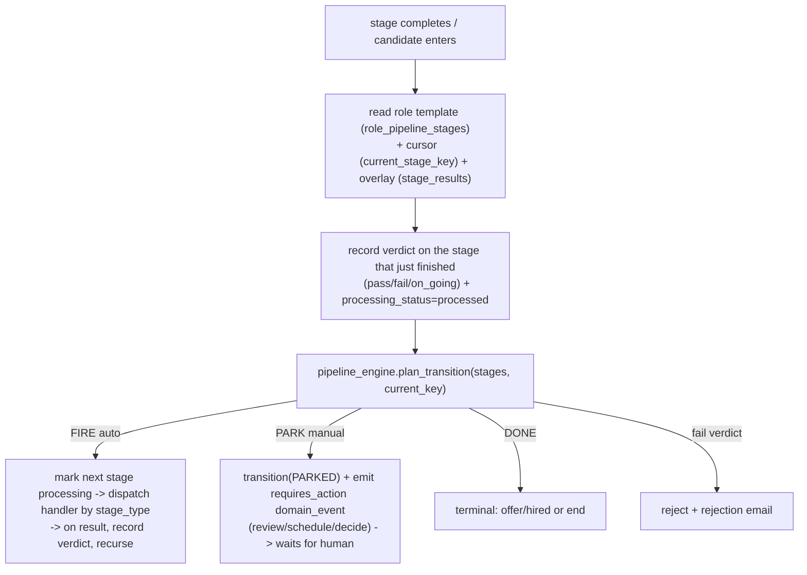

# 10 — Generic Stage Runner (make ANY configured pipeline run generically)

> **STATUS (2026-06-22): BUILT (Option B).** `applications.stage_results` overlay
> (migration 0036) + `services/stage_runner.advance_candidate` + `StageVerdict`
> (pending|on_going|pass|fail). All 6 decision points cut over to record-verdict +
> advance-via-engine; email_filter + fit are stage types; legacy current_stage kept
> as projection. 52 unit tests green (incl. 1-step, no-CEO P-0, reorder configs).
> This is 09's "Stage 2" written to implementation depth. Goal: a candidate runs
> the **role's configured pipeline** generically — any number of stages, any order,
> each `auto` or `manual` — with **no stage hardcoding "what comes next."** A
> 1-stage JD (e.g. email-filter only) works; a 9-stage JD works; reordering or
> dropping a stage "just works." Kills P-0 (the hardcoded tech→ceo→hr→offer tail).

---

## 1. The problem (what's wrong today)

Progression is **half generic**. The front half is already correct; the back half
still hardcodes GrabOn's specific chain.

**Generic already (good):**
- `role_pipeline_stages` = the per-role template (ordered rows, each with
  `stage_type`, `mode` auto|manual, `is_enabled`, `config`, `eval_spec`). JD
  creation writes it (`api/recruiter_chat.py:364`).
- `services/pipeline_engine.plan_transition(stages, current_key) -> Plan` = the
  **pure, unit-tested planner**: walks the enabled stages, skips inline/auto-
  advanced, returns the next FIRE_*/PARK_* action. No hardcoding. (23 tests.)
- `services/auto_progress.py` = IO shell that executes the plan (fire activity or
  park gate). Intake → parse → fit → `auto_progress()` already routes through it,
  so "no voice stage? skip it" already works on the front half.
- `services/state_machine.transition()/advance()` = a clean writer that validates a
  move against the role pipeline + emits `domain_events`. **Exists but nothing
  calls it yet.**
- `applications.current_stage_key` + `stage_status` = the per-candidate cursor,
  dual-written by `set_stage()`.
- `ProcessingStatus` enum (unprocessed/processing/processed/failed) — built for
  voice idempotency, reusable.

**NOT generic (the bug):** the stage-completion handlers hardcode the next GrabOn
stage instead of asking the engine:
- `activities/v1_meeting_analysis.py:119-178` — `technical pass → TECHNICAL_PENDING_APPROVAL`
  (assumes a CEO round follows); `ceo → CEO_PENDING_APPROVAL`; `hr → HR_EVALUATED`.
- `api/meetings.py` approval gates — `_GATE_STAGES` + `_kick_schedule_meeting` map
  rounds to the fixed technical/ceo/hr stages.
- `pipeline/v1.py` post-fit / post-screening branches — comments still say "voice
  is mandatory"; they call `auto_progress` but only after a legacy `set_stage`.

**Consequence:** a role configured `email-filter → fit → technical → offer` (no
CEO/HR) sets `TECHNICAL_PENDING_APPROVAL` after the tech round, then waits for a
CEO round that the pipeline doesn't contain → **stalls, never reaches offer.**

Also: **filtering + scoring aren't stage types.** Email heuristic filtering lives
hardcoded in `services/mail_ingest`; fit-scoring is hardcoded in `pipeline/v1`.
So a JD literally cannot say "I want only email filtering, nothing else."

---

## 2. The four requirements (owner, verbatim intent)

1. **Generic processing/analysis** — irrespective of `mode` (auto|manual). No
   hardcoding the next step inside an evaluator.
2. **1-step JD works** — e.g. only the email-filter heuristic, no scoring, no
   rounds. Filtering itself must be a configurable step.
3. **Configure any step at JD time** → store the flow in DB → fetch → check
   current → mark processed → move to next (unprocessed → processing → processed).
4. **Per-candidate flags for every stage** — each candidate carries, per stage:
   - **processing_status**: unprocessed | processing | processed | failed
   - **stage**: which pipeline stage (the one defined at JD time)
   - **verdict**: pending | **on_going** | pass | fail  *(on_going added per owner)*
   plus an **overall** status + current stage for the candidate.

---

## 3. The architecture decision: derive, don't materialize (Option B)

Two ways to satisfy requirement #4 (per-stage status + verdict):

| | **A. Materialize** | **B. Derive (CHOSEN)** |
|---|---|---|
| Model | New `application_stages` table; one row per (candidate, stage), created upfront | Template stays the only stage list; per-candidate state = cursor + a small `stage_results` overlay + the durable event log |
| Per-stage verdict | column on the row | `stage_results` JSONB map `{stage_key: {processing_status, verdict, result_ref, ...}}` on the application + `domain_events` history |
| "show all stages for candidate" | `SELECT * FROM application_stages` | walk role template + overlay (≤10 stages, trivial) |
| JD edit while candidates in-flight | **drift**: template vs copied rows; needs reconcile/migration | **no drift**: one source of truth (template); overlay only records what happened |
| New code / risk | +1 table, +materialize step, +cutover | +1 JSONB column, +overlay writes |
| Scale ceiling | millions of stage-rows / heavy reporting | fine to ~hundreds of stages per candidate; upgradable to A later (event log IS the materialization source) |

**Why B.** It's what the revamp plan already locked: SP2 principle #4 — *"the inbox
is derived, not maintained — a query over the event log + application state + a
small mutable overlay. No projection worker to drift."* And `09-runtime-wiring.md`
Stage 2 explicitly says progression *"walks the role's actual stage rows"* and
records via `domain_events` — never a per-candidate stage table. Option B gives the
**identical achievement** (all 4 requirements, P-0 gone, 1-step JD works) with ~60%
less code and lower risk, and stays consistent with decisions already shipped.
Option A is the documented **scale-up-later** path if reporting ever demands it.

### Data model (B)

```
role_pipeline_stages         (template, EXISTS)        the ordered stages a role defines
applications.current_stage_key  (cursor, EXISTS)       which stage the candidate is on
applications.stage_status       (EXISTS)               within-stage lifecycle
applications.stage_results  JSONB  (NEW, additive)     per-stage overlay:
    { "<stage_key>": {
         "processing_status": "unprocessed|processing|processed|failed",
         "verdict":           "pending|on_going|pass|fail",
         "result_ref":        "<audit_log id / score / blob pointer>",
         "updated_at":        "<iso>" } }
applications.overall_status  (EXISTS as `status`)       active|rejected|hired|withdrawn
domain_events                (EXISTS)                   durable per-stage history (stage_changed, requires_action, verdict_recorded)
```

`stage_results` is the **only schema change** — one nullable JSONB column + one
migration. Everything else already exists.

---

## 4. The generic loop

One driver replaces every hardcoded handler. Conceptually `advance_candidate`:



Key properties:
- **No handler names the next stage.** They write their verdict + call the driver.
  The driver asks `pipeline_engine` what's next. So tech→offer, tech→hr→offer,
  email-only — all the same code path.
- **`mode` is honored centrally.** auto → fire now; manual → park + `requires_action`
  event (the inbox card). The evaluator doesn't care which.
- **Idempotent.** A stage's `processing_status` gates re-entry (the same CAS pattern
  shipped for voice): `unprocessed → processing` claim before dispatch; a re-fired
  event that finds `processing`/`processed` is a no-op.

### Stage-type → handler registry

A single dict maps `stage_type` to its handler (mirrors `pipeline_engine._FIRE_ACTIONS`):

| stage_type | handler | mode default |
|---|---|---|
| `email_filter` *(NEW)* | run the deterministic funnel (`services/email_filter`) as a real stage | auto |
| `fit` *(formalize)* | `activities/fit_score` | auto |
| `screening` | `v1_generate_screening` | auto |
| `voice_screen` | `_fire_voice_screen` | auto |
| `assignment` | `_fire_assessment` | auto |
| `assessment_review` | park + `review_assessment` event | manual |
| `interview` (technical/ceo/hr/…) | park + `schedule_interview` event; on analysis, record verdict + advance | manual |
| `decision` | park + `hire_or_reject` event | manual |
| `offer` | `activities/offer` (sets HIRED) | manual/auto |

Adding `email_filter` + formalizing `fit` as catalog stage types is what makes
requirement #2 literally expressible: a JD's pipeline can be `[email_filter]` or
`[email_filter, fit]` and nothing else.

---

## 5. Candidate entry (requirement #4, the light way)

When a candidate enters a role (intake), we do **not** pre-create per-stage rows.
Instead:
- the cursor starts at the first enabled stage (`current_stage_key = stages[0]`);
- `stage_results` starts `{}` and is filled lazily as the driver touches each stage
  (`unprocessed` is the implicit default for any stage not yet in the map);
- a `candidate_entered` / `stage_changed` `domain_event` is emitted.

"Mark all stages unprocessed for the candidate" (owner's #4) is satisfied implicitly:
absence in `stage_results` == `unprocessed`. The driver writes a stage's entry the
moment it claims it (`processing`) and finalizes it (`processed` + verdict). If you
want them explicitly listed, a read helper `candidate_stage_view(app)` returns the
full template joined with the overlay, defaulting missing stages to
`{unprocessed, pending}` — same shape Option A's table would have, computed on read.

---

## 6. Back-compat: legacy `current_stage` stays as a projection (low risk)

Measured blast radius: `set_stage()` is called in ~25 files / 88 sites; `current_stage`
is **read** in 40+ files (every dashboard, all inbound webhooks, voice context/prompts,
recruiter tools, supervisor, workers/SLA, journey report). **We do NOT rip it out.**

- `set_stage()` already dual-writes `current_stage_key`/`stage_status` and emits
  events. The driver keeps the legacy `current_stage` updated via the existing
  representative-stage mapping (`state_machine._LEGACY_STAGE_KEY`, reversed).
- All 40+ readers keep working unchanged.
- The ~82 `set_stage(... NEEDS_HR_REVIEW ...)` **error-park** calls are left exactly
  as-is — they are not progression decisions.
- Only the **6 decision points** that hardcode "what's next" are cut over:
  `pipeline/v1.py` (post-fit, post-screening), `v1_meeting_analysis.py`,
  `v1_evaluate_voice_call.py`, `api/meetings.py` approval gates, `auto_progress.py`.

Removing the legacy column entirely is a **separate, later, careful pass** once
everything reads the overlay — explicitly out of scope here.

---

## 7. Implementation plan (dependency-ordered, each ships green)

1. **`stage_results` column + migration** (additive, nullable JSONB). + repo
   helpers: `record_stage_processing/verdict`, `candidate_stage_view`. **Low risk.**
2. **`services/stage_runner.py`** — `advance_candidate(application_id)` + the
   `stage_type→handler` registry, wrapping the existing `pipeline_engine`. Pure-ish;
   unit-tested exhaustively like `pipeline_engine` (1-stage, N-stage, auto/manual mix,
   fail-midway, idempotent re-entry). **Low risk (new code, nothing calls it yet).**
3. **Cut the 6 decision points over** to: write verdict → call `advance_candidate`.
   Kills P-0; makes #1 real. **Med risk — the only behavior change.** Verified by the
   driver tests + a scripted end-to-end of the "email→fit→tech→offer" config.
4. **Add `email_filter` + `fit` as catalog stage types + handlers** (#2 fully).
   `mail_ingest` calls the `email_filter` handler; `pipeline/v1` fit becomes a stage.
   **Low-med risk.**
5. **Per-stage verdict surfacing** — ensure `domain_events` `verdict_recorded` +
   `stage_results` are written everywhere a verdict is produced (#4). **Low risk.**
6. **(Later, separate)** retire legacy `current_stage`. **Out of scope.**

### Verdict semantics (owner-approved)
- `pending` — stage not started (default / unprocessed).
- `on_going` — stage started, no decision yet (e.g. interview scheduled, awaiting
  analysis; voice call placed, awaiting eval).
- `pass` — stage cleared; driver advances.
- `fail` — stage failed; driver rejects (+ rejection email on the auto lane).

### Verification bar
- `compileall src` clean.
- New `tests/unit/test_stage_runner.py` (driver) + existing `test_pipeline_engine`
  (planner) green.
- Scripted configs proven end-to-end: `[email_filter]` (1-step),
  `[email_filter, fit, technical, offer]` (no CEO/HR — the P-0 case),
  `[email_filter, fit, voice_screen, assignment, assessment_review, technical, ceo, hr, decision, offer]`
  (full), each completing to its terminal without a hardcoded assumption.

---

## 8. What this delivers vs the 4 requirements

| Req | Delivered by |
|---|---|
| #1 generic, mode-agnostic processing | driver + registry (step 2-3); evaluators stop hardcoding |
| #2 1-step JD (email filter only) | `email_filter`/`fit` as stage types (step 4) + the generic loop |
| #3 configure → store → fetch → mark processed → next | template (exists) + cursor + `stage_results` overlay + driver |
| #4 per-candidate flags (status/stage/verdict incl. on_going) | `stage_results` + `domain_events`; `candidate_stage_view` read helper |

Same achievement as the heavy `application_stages` table, less code, no drift,
consistent with the revamp's already-locked "derive, don't materialize" principle.
